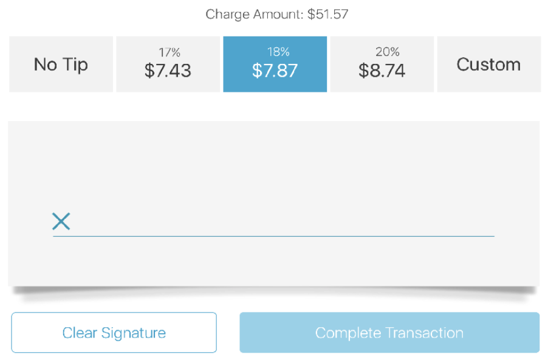
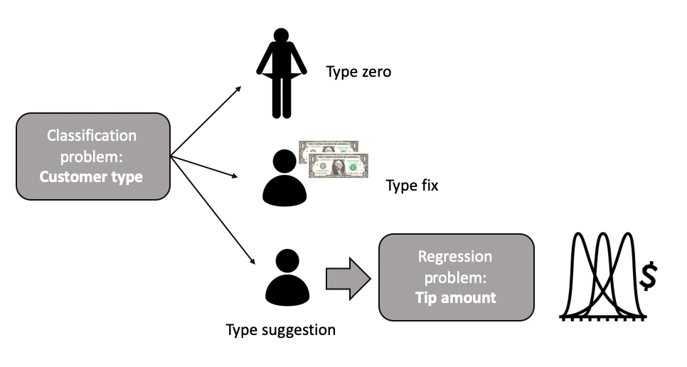

# Introduction
This code is part of a data analysis that predicts the taxi tips to riders in NYC.
It uses historical data coming from the [NYC Taxi & Limousine Commission](https://www1.nyc.gov/site/tlc/about/tlc-trip-record-data.page).
For this exercise, we use data corresponding to March, June and November 2017. This document presents the feature exploration and data summary.

We start by setting the environment and loading the data from Part 1: data exploration and cleaning.

```{r warning = FALSE, echo = T, results = 'hide', message = FALSE}
library (dplyr)
library (GGally)
library (rgdal)
library (ggplot2)
library (sp)
library (httr)
library (leaflet)
library (broom)

yellowtripdata <- as_tibble(readRDS("data/clean_data/YellowTripCleanData_03_06_11_2017.rds"))
```

# Tip amount distribution
The most important distribution of the analysis is the tip amount. This section tries to get as much insight as possible.

```{r}
yellowtripdata %>% ggplot (aes (x = tip_amount)) + geom_density() + xlab ("tip_amount [$]") 
```

From the distribution we identify three different customer types who are summarized in the following table:

|Customer type | Behavior |
|----------|-------------|
| *Type suggestion* | They tip one of the percentages suggested by the payment application |
| *Type zero* | They tip \$ 0 or in cash|
| *Type fix* | They tip a fixed amount \$ 1, 2, 3 ... |

Further analysis of *Type suggestion* customers could lead to additional classes depending on their preferred tip \%, e.g. 18%, 20% or 22%. The following image presents an example of a US tip amount suggested by a payment application.  
 {width=50%}

Let us check now how much customers tip as a function of the location they are dropped off.

```{r message = FALSE, warning = FALSE}
ny_taxi_zones <- readRDS("data/clean_data/ny_taxi_zones_enrich_map.rds")

## We bin the tip_mean and associated a 10 color palette for visualization.
bins <- seq(0, 4, by=0.45) 
pal <- colorBin("YlOrRd", domain = ny_taxi_zones$tip_mean, bins = bins)

## We label the polygons with name and tip mean.
labels <- sprintf(
        "<strong>%s</strong><br/>&dollar;%g",
        ny_taxi_zones$zone, ny_taxi_zones$tip_mean) %>% 
     lapply(htmltools::HTML)

## We add the polygons with all tip information and legend
leaflet(ny_taxi_zones) %>%
     addTiles() %>% 
     addProviderTiles("CartoDB.Positron") %>%
     addPolygons(popup = ~zone,
                    fillColor = ~pal(tip_mean),
                    stroke = TRUE, color = "black", weight = 0.2,
                    label = labels) %>%
        addLegend(pal = pal, values = ~tip_mean, 
                  opacity = 0.7, title = NULL,
                  position = "bottomright")
```

As observed in the map, drop off location plays an important role in the tip amount a customer will give. Interesting to see how people dropped off in Unionport will give an average \$3.3 compared to other neighborhood like Co-op city with \$0.8. This trend can be explained by various factors, either Unionport population has larger income and tend to tip more, trips ending there are longer due to its relative location to Manhattan (where most of the trips start or end) or a combination of both.

```{r}
yellowtripdata %>% mutate (tip_per = tip_amount/total_amount*100) %>% 
                ggplot (aes (x = tip_per)) + stat_density() + xlab ("Tip/Total [%]")
```

The percentage of the given tip shows a very interesting structure with peaks at around 18, 20 and 22 \% that help us understand a bit more customer tip behavior. Particularly the customer that we defined previously as *Type suggestion* who generally tip the suggested \% by the machine. In summary, we can further segment our customers as:

|Customer type |
|---------------| 
| *Type 18 \%* | 
| *Type 20 \%* | 
| *Type 22 \%* |   


```{r}
set.seed (100)
yellowtripdata %>% 
  sample_n(10000) %>% ### Too many points for obtaining quickly and a smooth scatter plot. 
  ggplot (aes (x = tip_amount, y = total_amount)) +  geom_point()
```

This graph confirms yet again that the **customer type is a key driver in the tip a driver receives**. We can observe the customers that go with fix amounts who correspond to the vertical lines. The non-vertical structures can be associated with the customer that tip a fixed percentage of the total amount, where each cluster correspond to a fix percentage amount e.g. 18 \%, 20 \%, 22 \%...

# Continuous variables

Let us build a scatterplot with all numeric variables to see how they correlate with the tip amount. Since we are exploring and in order to speed up the process, we randomly sample 10000 trips.

```{r warning = FALSE}
set.seed (100)
yellowtripdata %>% select_if(is.numeric) %>% 
                   select (-tip_amount, everything()) %>% # We put the tip_amount as the last column
                   sample_n(10000) %>% 
                   ggpairs(progress = FALSE)
```
 
As expected, the largest correlations from these set of variables come from trip_distance, fare_amount, and trip_time_min. Total_amount is the sum of all charges including tip, meaning that we can not use this variable for predicting the tip.

### Summary

|Variable | Observation | Action |
|---------| ------------| ------ |
|passenger_count | Does not show correlation with tip | We keep it in case non-linear dependencies can be exploited|
|trip_distance | Strong correlation | We keep it |
|fare_amount | Strong correlation | We keep it|
|extra | Does not show correlation with tip | We keep it since fare + extra correlates with total therefore also with the tip|
|mta_tax | Very small sd | We drop it|
|tolls_amount | Does not show correlation with tip | We keep it. Same reason as extra|
|improvement_surcharge|Very small sd | We drop it|
|total_amount| Strong correlation | We can not keep it since the total is computed once the tip is added|
|trip_time_min| Strong correlation | We keep it |

# Categorical variables

```{r warning = FALSE, message = FALSE}
set.seed (100)
yellowtripdata %>% select (RatecodeID, store_and_fwd_flag, pickup_month, tip_amount) %>% 
     select (-tip_amount, everything()) %>%   # We put the tip_amount as the last column
     sample_n(10000) %>%
     ggpairs(progress = FALSE)
```

```{r warning=FALSE}
 yellowtripdata %>% ggplot (aes (y = tip_amount)) + 
  geom_boxplot(aes (x = dropoff_hour ), color="darkblue", alpha = 0.5) + 
  geom_boxplot(aes (x = pickup_hour), color="darkred", alpha = 0.5) +
  xlab ("hour of the day")
```

Interesting to see how customers give fewer tips on early morning trips. Also, we can observe how pick up (dark red) and drop-off (dark blue) hours present a similar trend when plotted against the tip. I suspect people going to work is more stress, less happy and less incline to tip their drivers. Although it can also be that those trips are just shorter in time or length. Let us check it...

```{r warning=FALSE, cache = TRUE}
 yellowtripdata %>% ggplot (aes (x = dropoff_hour, y = trip_mean_speed)) + 
  geom_boxplot () + 
  ylim (0., 0.6) +
  ylab ("trip mean speed [miles/min]")
```

According to the trend, early morning trips are faster because of traffic lack. This translates in lower fare and less tip for drivers.

```{r warning=FALSE}
 yellowtripdata %>% group_by (dropoff_hour) %>% tally () %>% 
                    ggplot (aes (x = dropoff_hour, y = n, group = 1)) + 
                    geom_line() +ylab ("Total number of trips")
```

Luckily for taxi drivers, this is the time with less activity.

```{r warning=FALSE}
 yellowtripdata %>% ggplot (aes (x = dropoff_wday, y = tip_amount)) + 
  geom_boxplot () 
```

Tip as a function of weekday (Sunday = 1,..., Saturday = 7) shows a soft uptrend in the middle of the week. These could be explained by the trip types being those longer in distance or time due to heavy traffic.

## Location

Although the pickup and drop-off locations may play a role in the tip given by a customer, we are using at the moment limited information about the taxi locationID zones. Therefore any major insight in the variables DOLocationID and PULocationID are expected to be associated with their separation distance. This could change if information like area average income, office/business/houses density or public transportation availability would be available.

Therefore, we have decided to also remove these variables to reduce the complexity of the ML models. Having two categorical variables with more than 200 classes each could end up adding more than 400 dummy variables to the training dataset. A transformation from locationID zone to polygon lat lon centroid was considered and discarded. Although this solves the issue of the dummy variables, it is not expected to bring any useful insight.

## Summary

|Variable | Observation | Action |
|---------| ------------| ------ |
|RatecodeID | Imbalance sample almost all trips remaining correspond to "1 = Standard rate" | We drop it|
|store_and_fwd_flag |Not relevant information and imbalance sample | We drop it|
|pickup_month/dropoff_month| Not enough data to obtain seasonality effects | With only 3 months dataset we drop it |
|dropoff_hour/dropoff_wday | Trends are observed | We keep it | 
|pickup_hour/pickup_wday| Trends observed are similar to drop-off | We drop it to simplify the model |

# Conclusion

**The most important information to predict a tip is the customer type which explains its tip general behavior**. We have classified customers in Type zero, Type fix and Type suggestion, where the last one can be further classified in Type 18 \% Type 20 \% and Type 22 \%.   

{width=50%}

Since we do not have any customer information, we will focus all our efforts in the type suggestion customers. For that, we will remove events with tips = 0, 1 and 2. Then we will use regression machine learning algorithms to model the tip given by customers type suggestion. This filter will affect our regression model sample, but let us ignore the effect for the moment, we will solve this in future analyses.

```{r}
yellowtripdata <- yellowtripdata %>% filter (tip_amount != 0, tip_amount!=1,tip_amount!=2) 
```

Strong correlations and trends are observed among many variables. From the 20 variables analyzed, we will keep 9 + tip_amount and from them, we expect to be the ones with the strongest modeling and prediction power:

* trip_distance: the longer the trip, the larger the amount, the larger the tip.
* fare_amount: in US tip is generally calculated by customers as a percentage of the fare (including tolls and extras).
* trip_time_min: same as before.
* dropoff_hour: customers show to tip less in early morning trips because trips are quicker.
* dropoff_wday: customers show to tip more on Wednesdays and Thursdays probably because of longer trips due to traffic.

We save a new dataset ready to be used directly by the ML algorithms.
```{r}
yellowtripdata_ML <- yellowtripdata %>% select (-mta_tax,-improvement_surcharge,-total_amount,-RatecodeID,
                                                -store_and_fwd_flag, -pickup_month, -dropoff_month, -pickup_hour, -pickup_wday,
                                                -DOLocationID,-PULocationID) %>%
        select (-tip_amount,everything()) # We store tip_amount at the end of the dataframe.
saveRDS (yellowtripdata_ML, "data/clean_data/YellowTripMLData_03_06_11_2017.rds")
```
