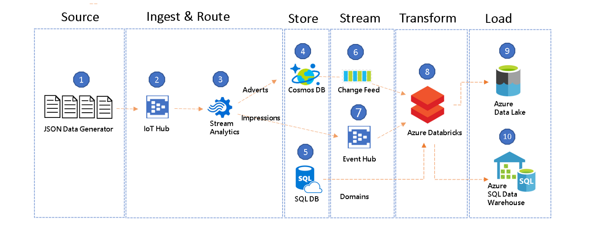
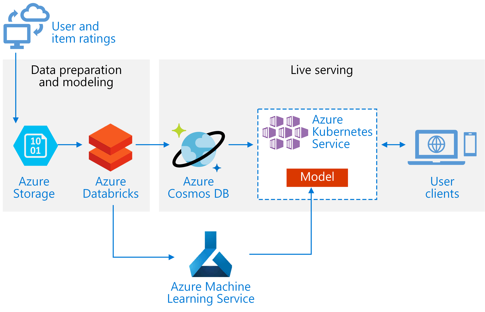

# Introduction
This code is part of a data analysis that predicts the taxi tips to riders in NYC.
It uses historical data coming from the [NYC Taxi & Limousine Commission](https://www1.nyc.gov/site/tlc/about/tlc-trip-record-data.page).
For this exercise, we use data corresponding to March, June and November 2017. This document presents the model building.

To help us with the training of the machine learning algorithms, we are going to use the [caret package](https://cran.r-project.org/web/packages/caret/vignettes/caret.html) (short for Classification And REgression Training). 

We start by setting the environment and loading the data from Part 2: data summary.

```{r warning = FALSE, echo = T, results = 'hide', cache = TRUE, message = FALSE}
library (dplyr)
library (caret)
library (doParallel) 

yellowtripdata <- as_tibble(readRDS("data/clean_data/YellowTripMLData_03_06_11_2017.rds"))
```

# Performance

In order to boost caret's package functions performance, we parallelize the analyze and use all available local cores.

To overcome the known error with R "vector memory exhausted" in MAC when fitting large datasets locally, we reduce the size of the sample to make our life easier while running this exploratory analysis. This error could be easily overcome in a Spark cluster and then use [sparklyR](https://spark.rstudio.com/) to translate R into Spark.

```{r}
cl <- makeCluster(detectCores(), type='PSOCK')
registerDoParallel(cl)

yellowtripdata <- yellowtripdata %>% sample_n (50000)
```

# Data preparation

We start by creating a training and a testing datasets with a sample split of 80 and 20\% respectively.

```{r warning= FALSE}
set.seed (100)
## we randomly generate the row numbers for the training dataset and create it.
trainRowNumbers <- createDataPartition(yellowtripdata$tip_amount, p=0.8, list=FALSE)
trainData <- yellowtripdata[trainRowNumbers,]

## we create the testing set.
testData <- yellowtripdata[-trainRowNumbers,]
```

The caret package contains a variety of functions to help you prepare your dataset. Some of them are:

* One-Hot Encoding
* Range Normalization
* Recursive feature elimination
* ...

Caret's training function can also take care of most of these automatically. Given the low complexity of our features, we will let the package do the job. 

# Benchmark

We start by fitting our data to a simple linear model. This will allow us to benchmark and understand if the correlation between the tip and the features available are linear. When training against more complex algorithms, having this benchmark will help us detect hidden dependencies or non-linear correlations.


```{r}
model_lm = train(tip_amount ~ ., data=trainData, method = 'lm')
```

## Variable importance

```{r}
varimp_lm <- varImp(model_lm )
plot(varimp_lm, main="Variable Importance with lm")
```

As expected, the most important variable to estimate a tip is the fare amount. Then will come tolls and any extra expense which are added to the bill and therefore will affect the total amount suggested to tip. Dropoff hours in the morning and average trip speed, accounting for the traffic, will come next. Interesting to see that most of the prediction power from trip time and distance is better captured by the fare and the speed. We can also confirm our suspicion that the little information on traffic capture in the weekday ranks low. 


# Models 

We will fit our training set to a few types of supervised machine learning regression algorithms. Among the long list available, we will train a set of the most commonly used methods:

* Multivariate Adaptive Regression Splines MARS (aka earth in R): this model learns the linear dependencies to then apply cutpoints/step functions to fit the data per regions. It could help us fit better at lower and higher tip amounts. It uses nprune, degree as tuning parameters. 
* Support Vector Machines (svm): by building a higher dimensional feature space, we expect to find hidden correlations. It uses sigma, C as tuning parameters.
* Cubist: this model mixtures decision tree/rule base analysis and linear regression. It could help us cluster the different customers % types to then apply a regression. Very easy to interpret, it has committees and neighbors as tuning parameters.
* eXtreme Gradient Boosting (xgbDART): a decision tree-based algorithm that is boosted iteratively. Same as with the cubist, we hope to cluster the different customer types. Tuning parameters: nrounds, max_depth, eta, gamma, subsample, colsample_bytree, rate_drop, skip_drop, min_child_weight.
* Random Forest (rf): another decision tree-based algorithm that aims to capture all possible variance by randomly building a large set of decision trees. Tuning paremeter mtry.

# cross-validation and Hyper Parameter Tuning

For cross-validation, we will use the caret's method cv with 3-folds. The trainControl function can be easily set to implement and configure other methods.

``` {r}
control <- trainControl (method = "cv", # Cross-validation method.
                         number = 3)    # Number of 
```

Caret's train and trainControl functions can also take care of the parameter tuning. One can select a set of parameters using tuneGrid or randomly create it with tuneLength. Given that this is an exploratory analysis, we will let caret take also care of the model's fine-tuning.

# Model training

```{r cache = TRUE, message = FALSE, warning = FALSE}
model_lm      = train(tip_amount~., data=trainData, trControl=control, method="lm") # we train it again with same cv method to compare results.
model_earth   = train(tip_amount~., data=trainData, trControl=control, method="earth")
model_svm     = train(tip_amount~., data=trainData, trControl=control, method="svmRadial")
model_cubist  = train(tip_amount~., data=trainData, trControl=control, method="cubist")
model_xgbDART = train(tip_amount~., data=trainData, trControl=control, method="xgbDART")
model_rf      = train(tip_amount~., data=trainData, trControl=control, method="rf")
```

# Model performance comparison
```{r}
model_comparison <- resamples(list(linear  = model_lm,
                                   earth   = model_earth,
                                   svm     = model_svm,
                                   cubist  = model_cubist,
                                   xgbDART = model_xgbDART,
                                   rf      = model_rf))
summary(model_comparison)
```

```{r}
# Draw box plots to compare models
scales <- list(x=list(relation="free"), y=list(relation="free"))
bwplot(model_comparison, scales=scales)
```
Given that the goal of this analysis is to predict the likely tip amount, we should rank our algorithms using Mean Absolute Error (MAE). We observed that while all algorithms perform similarly, randomForest shows poor numbers. This could be explained because the random trees were not able to capture all the variance. If we were to chose one from the list, clearly cubist is the MAE winner. The business rules built by algorithm seems to generate the most accurate tip predictions.

# Testing 

Let us see how performs our best algorithm with unseen data.

```{r}
predicted <- predict(model_cubist, testData[, 1:10])
postResample(pred = predicted, obs = testData$tip_amount)
```

Cubist is able to predict a tip (from customers that press a suggested \%) with a Mean Absolute Error of \$ 0.3. 

# Next steps

1. Run in more data.
2. Obtain customer data. From personal experience, a tip general relates more to the person that tips than to the service received. In order to identify customer types, we need customer data e.g. gender, age, income...
3. Obtain pick up and drop-off location information like area average income, office/business/houses density or public transportation availability. A good place to start could at the project [NYC Open Data](https://opendata.cityofnewyork.us/).
4. Move the analysis to a Hadoop cluster. Tools like Spark will help a lot...
5. Validate/remove all simplification assumptions e.g. tip filter, trip length...
6. Download all historical data available [link](https://www1.nyc.gov/site/tlc/about/tlc-trip-record-data.page). Check for seasonality effects.
7. With more data and more complex models, ensemble learning could help boost overall performance.

# Moving a model intro production

A taxi fare tip recommendation model like the one built here will require high availability and scalability. With millions of transactions a month, variable traffic patterns and system workload demand, a cloud-based API will be the most suitable solution to build and maintain. Any major vendor offers a variety of services and possibilities, I will describe a way of deploying the model using Azure and [Databricks](https://databricks.com/).

1. Build a Data Lake and store all historical information available.
2. Build an ETL pipeline that connects to all taximeter (IoT), stores and analyzes the data. Databricks and Spark allow to have batch (historical) and streaming within the same framework, making it easier to deploy new algorithms. A high-level architecture is presented in the image and more detail description in this [link](https://medium.com/microsoftazure/an-introduction-to-streaming-etl-on-azure-databricks-using-structured-streaming-databricks-16b369d77e34).

{width=50%}

3. We add a ML learning service to support the deployment of new modules, to monitor performance or schedule training jobs. 
{width=50%}