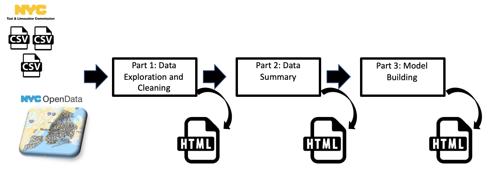

# NYC-Taxi-Tip-Analysis
In this repository, you would find a study done on data of NYC yellow taxis which focuses on New Yorkers' tipping habits. 

## Data
* Yellow taxi trip data from March, June and November 2017 provided by the [NYC Taxi & Limousine Commission](https://www1.nyc.gov/site/tlc/about/tlc-trip-record-data.page).
* NYC Taxi Zones provided by [NYC OpenData project](https://data.cityofnewyork.us/Transportation/NYC-Taxi-Zones/d3c5-ddgc).

## Analysis
The analysis is divided in 3 sections:
1. Cleaning and exploration. 
2. Data summary 
3. Model and predictions

